A custom human resources and time tracking application built for a small team. The app features users accounts with multiple levels of access, real time updates, and a robust level of employee management. 

#### Employee List
View all active and inactive employees

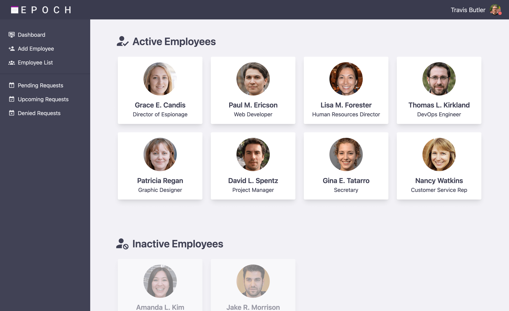

#### Employee Profile
View and manage all eployee information

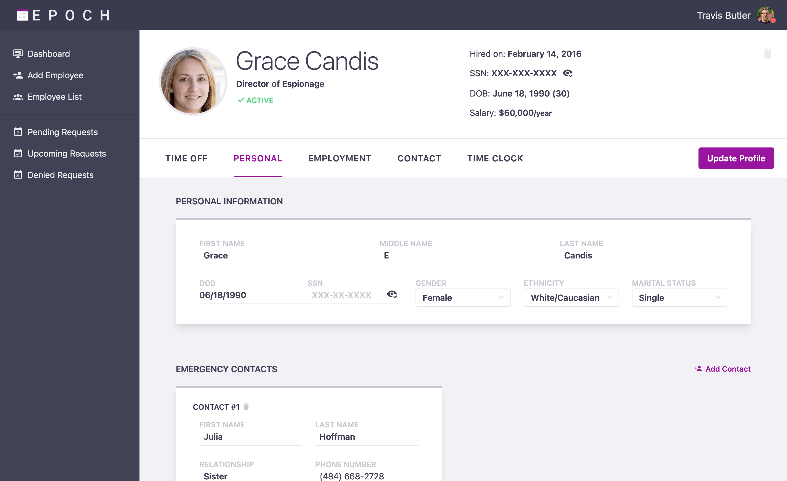

#### Pending Requests
See all pending requests and approve or deny

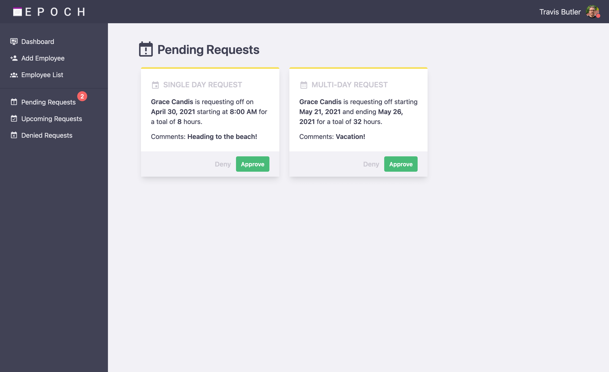

#### Upcoming Request
See all upcoming time off requests

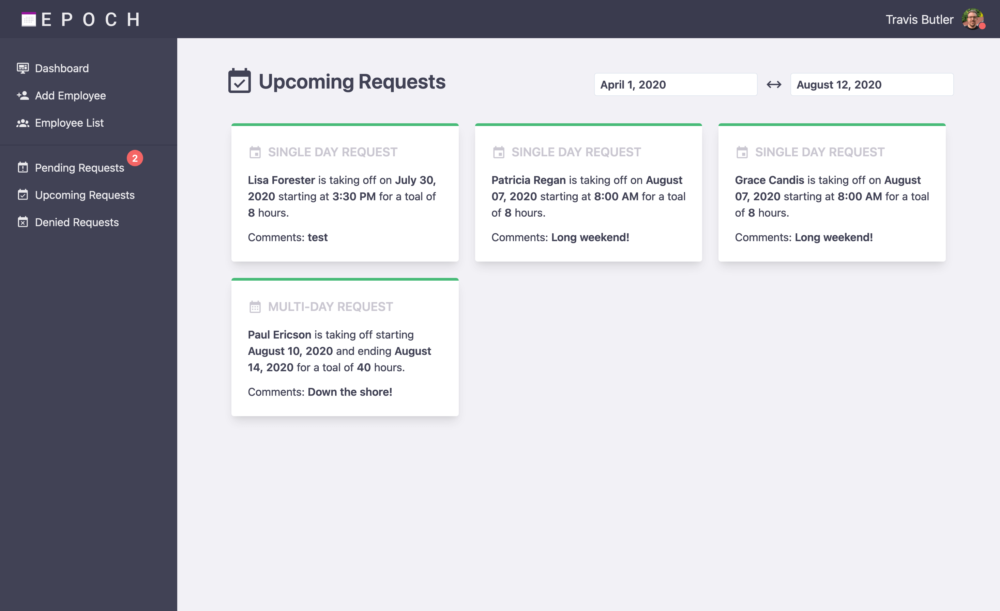

#### Denied Requests
See all denied requests and approve if needed

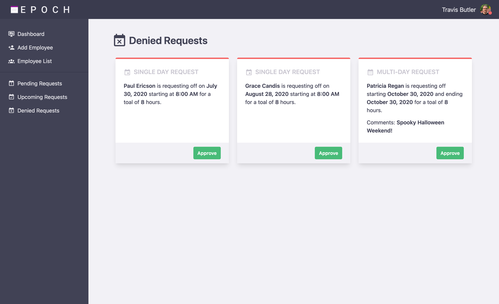
#### Single Day Request
Input for a single day request

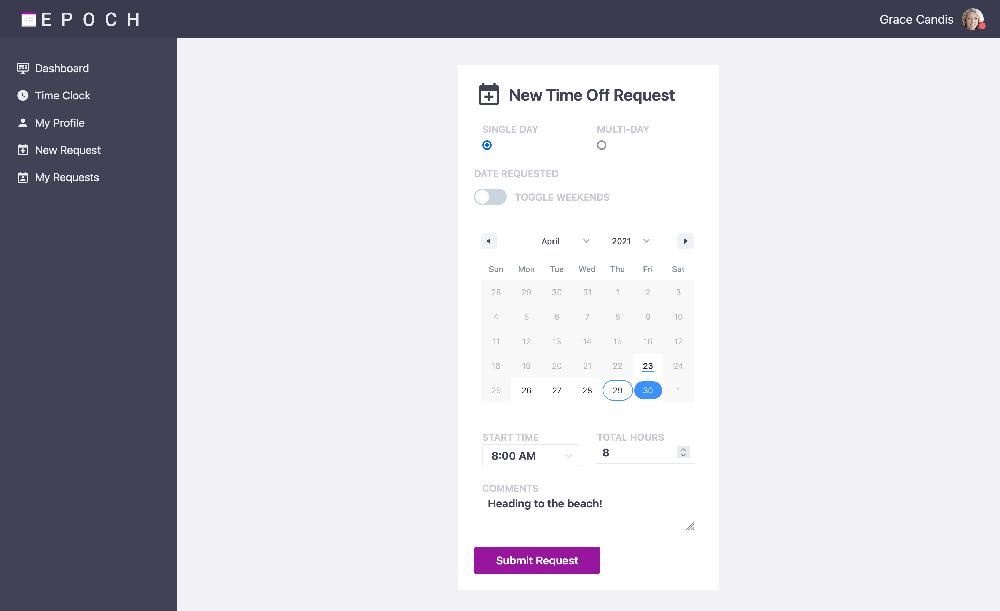

#### Multi-Day Request
Input for a multi-day request

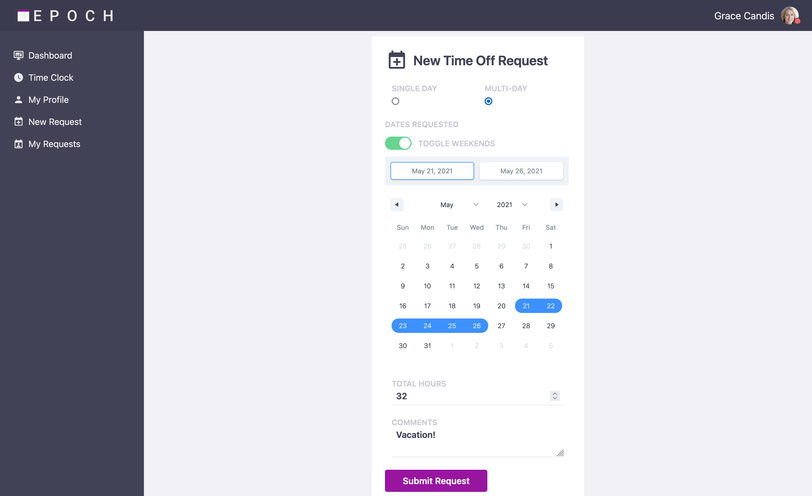

#### Employee Requests
View and manage all time off requests

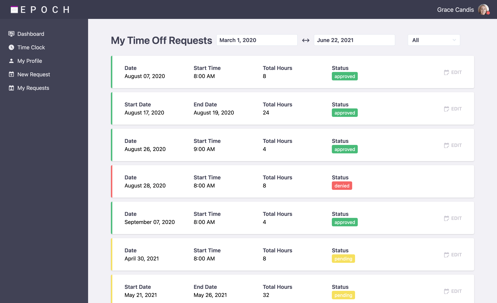

#### Users
View and manage users and their permissions

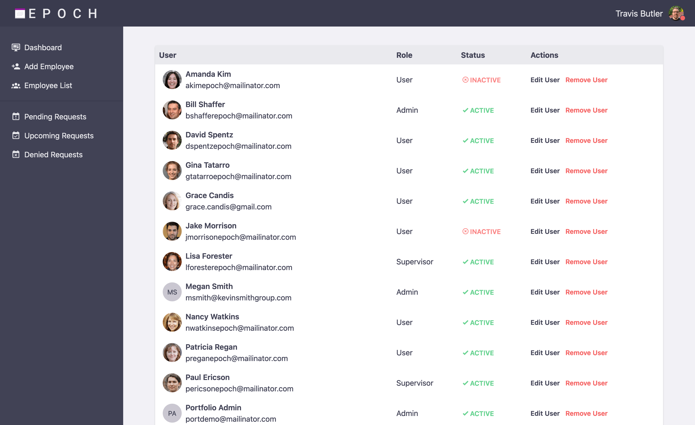

#### Edit User
Change user permisions or delete

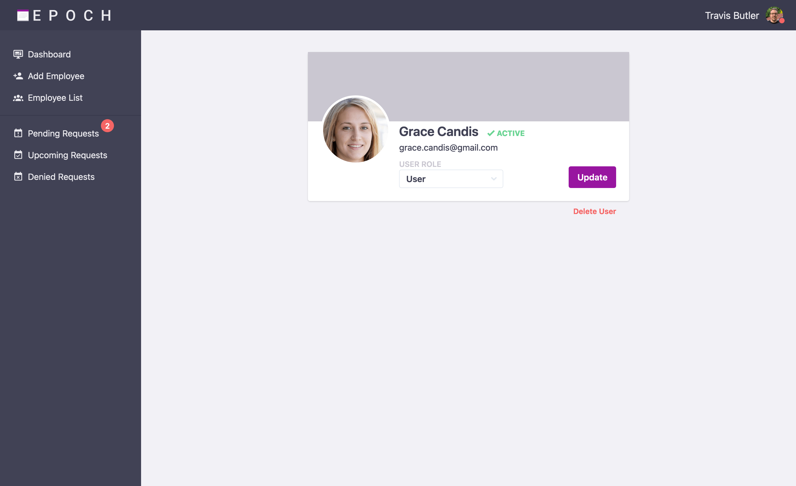

#### Edit Account
Admin accoutn view

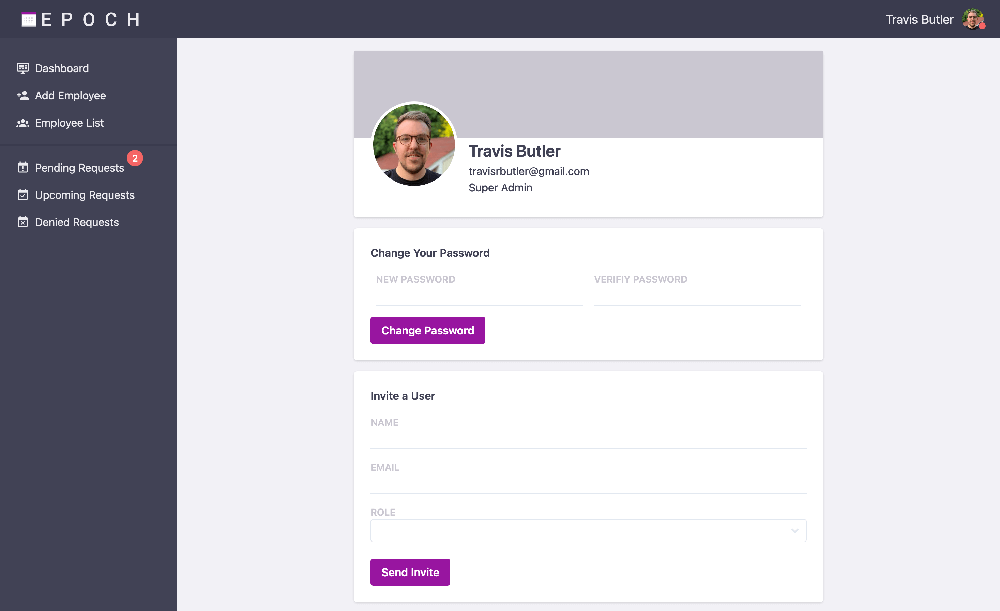

#### Dashboard
Admin dashboard view

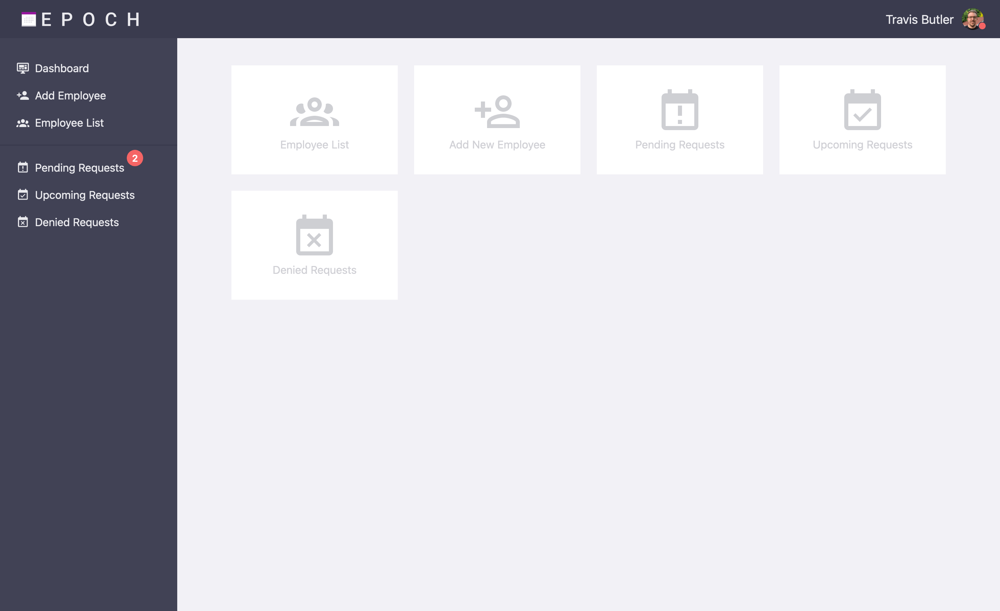

